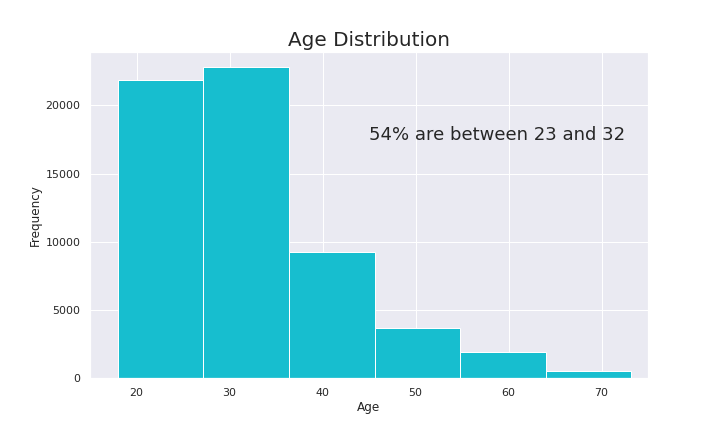
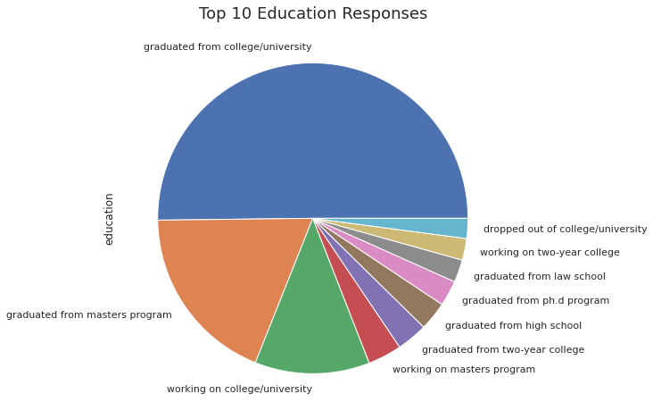

# Making Predictions with Dating Profile Data
## A codecademy Machine Learning Capstone Project

**Objective:** The purpose of this capstone project is to practice formulating questions and implementing Machine Learning techniques to answer those questions.

The dataset for this project consists of 59,946 dating profiles provided by the online dating site, okcupid.

After analysis, part of the project requirement was to produce a [presentation](ML_Capstone_Presentation.pdf).

Programming languages and libraries used: 
- python
- pandas
- scikit-learn
- numpy
- matplotlib
- seaborn

It may be easier to view the code by copying/pasting the url for the .ipynb [file](Capstone_Project_Final.ipynb) into [nbviewer](https://nbviewer.jupyter.org/).
